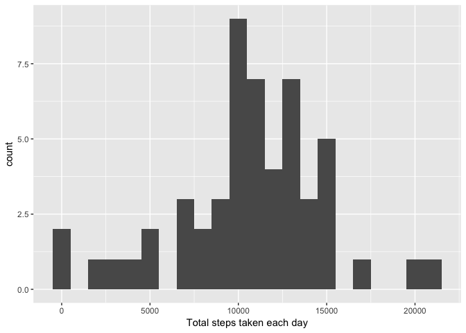
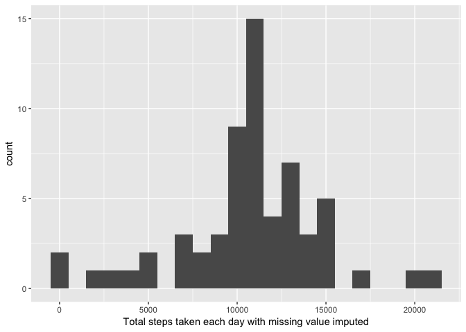
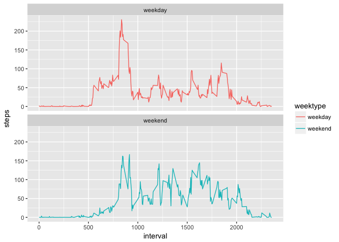

# Reproducible Research: Peer Assessment 1
Ayuta Padhi  
January 28, 2017  


```r
library(ggplot2)
```

```
## Warning: package 'ggplot2' was built under R version 3.3.2
```

```r
library(lubridate)
```

```
## 
## Attaching package: 'lubridate'
```

```
## The following object is masked from 'package:base':
## 
##     date
```

```r
library(dplyr)
```

```
## 
## Attaching package: 'dplyr'
```

```
## The following objects are masked from 'package:lubridate':
## 
##     intersect, setdiff, union
```

```
## The following objects are masked from 'package:stats':
## 
##     filter, lag
```

```
## The following objects are masked from 'package:base':
## 
##     intersect, setdiff, setequal, union
```
## Loading and preprocessing the data


```r
unzip("activity.zip")
activity <- read.csv("activity.csv")
```

Check the data


```r
head(activity)
```

```
##   steps       date interval
## 1    NA 2012-10-01        0
## 2    NA 2012-10-01        5
## 3    NA 2012-10-01       10
## 4    NA 2012-10-01       15
## 5    NA 2012-10-01       20
## 6    NA 2012-10-01       25
```

## What is mean total number of steps taken per day?

For this part of the assignment, you can ignore the missing values in the dataset.

1. Calculate the total number of steps taken per day
2. If you do not understand the difference between a histogram and a barplot, research the difference between them. Make a histogram of the total number of steps taken each day
3. Calculate and report the mean and median of the total number of steps taken per day

### Steps :

1. Aggregate the total steps taken each day


```r
steps.each.day <- aggregate(steps ~ date, data = activity, FUN = sum)
head(steps.each.day)
```

```
##         date steps
## 1 2012-10-02   126
## 2 2012-10-03 11352
## 3 2012-10-04 12116
## 4 2012-10-05 13294
## 5 2012-10-06 15420
## 6 2012-10-07 11015
```

2. Use qplot to plot the histogram of the total number of steps taken each day


```r
qplot(as.numeric(steps.each.day$steps), geom="histogram", binwidth=1000, xlab = "Total steps taken each day") 
```

<!-- -->

3. Calculate mean and median number of steps taken each day

#### Mean


```r
mean(steps.each.day$steps, na.rm=TRUE)
```

```
## [1] 10766.19
```

#### Median


```r
median(steps.each.day$steps, na.rm=TRUE)
```

```
## [1] 10765
```

## What is the average daily activity pattern?

### Steps :

1. Calculate average number of steps taken in each interval


```r
average.steps <- aggregate(steps ~ interval, data = activity, FUN = mean, na.rm = TRUE)
```

2. Make a time series plot (i.e. 𝚝𝚢𝚙𝚎 = "𝚕") of the 5-minute interval (x-axis) and the average number of steps taken, averaged across all days (y-axis)

         Use ggplot to plot the time series plot


```r
ggplot(data=average.steps, aes(x=interval, y=steps)) +
        geom_line() +
        xlab("5-minute interval") +
        ylab("average number of steps taken")
```

<!-- -->

3. Which 5-minute interval, on average across all the days in the dataset, contains the maximum number of steps?


```r
average.steps[which.max(average.steps$steps),]
```

```
##     interval    steps
## 104      835 206.1698
```

## Imputing missing values

1. Calculate and report the total number of missing values in the dataset (i.e. the total number of rows with 𝙽𝙰s)
2. Devise a strategy for filling in all of the missing values in the dataset. The strategy does not need to be sophisticated. For example, you could use the mean/median for that day, or the mean for that 5-minute interval, etc.
3. Create a new dataset that is equal to the original dataset but with the missing data filled in.
4. Make a histogram of the total number of steps taken each day and Calculate and report the mean and median total number of steps taken per day. Do these values differ from the estimates from the first part of the assignment? What is the impact of imputing missing data on the estimates of the total daily number of steps?

### Steps :

1. Find all the missing values using is.na and use table to display number of rows with missing value.


```r
missing.activity <- is.na(activity$steps)
table(missing.activity)
```

```
## missing.activity
## FALSE  TRUE 
## 15264  2304
```


2. Calculate average steps in that same interval to replace missing values

```r
activity.imputed <- activity
avg.interval <- tapply(activity$steps, activity$interval, mean, na.rm=TRUE, simplify=TRUE)
```

3. Create a new dataset that is equal to the original dataset but with the missing data filled in
        

```r
activity.imputed$steps[missing.activity] <-avg.interval[as.character(activity.imputed$interval[missing.activity])]
```

        Check the data

```r
head(avg.interval)
```

```
##         0         5        10        15        20        25 
## 1.7169811 0.3396226 0.1320755 0.1509434 0.0754717 2.0943396
```

4. Aggregate total steps taken each day for the imputed dataset


```r
total.steps <- aggregate(steps ~ date, data = activity.imputed, FUN = sum)
```

5. Make a histogram of the total number of steps taken each day


```r
qplot(as.numeric(total.steps$steps), geom="histogram", binwidth=1000, xlab = "Total steps taken each day with missing value imputed") 
```

<!-- -->

6. Mean and Median after missing values are imputed

#### Mean


```r
mean(total.steps$steps)
```

```
## [1] 10766.19
```

#### Median


```r
median(total.steps$steps)
```

```
## [1] 10766.19
```

#### Do these values differ from the estimates from the first part of the assignment?

Yes.

#### What is the impact of imputing missing data on the estimates of the total daily number of steps?

The Mean and Median equals to 10766.19 after imputing the data with the average number of steps in the same 5-min interval.

## Are there differences in activity patterns between weekdays and weekends?

1. Create a new factor variable in the dataset with two levels – “weekday” and “weekend” indicating whether a given date is a weekday or weekend day.
2. Make a panel plot containing a time series plot (i.e. 𝚝𝚢𝚙𝚎 = "𝚕") of the 5-minute interval (x-axis) and the average number of steps taken, averaged across all weekday days or weekend days (y-axis). See the README file in the GitHub repository to see an example of what this plot should look like using simulated data.

### Steps :

1. Use lubridate and dplyr to add a new column weektype with two levels “weekday” and “weekend” indicating whether a given date is a weekday or weekend day to the new imputed dataset.


```r
activity.imputed$date <- ymd(activity.imputed$date)
activity.imputed <- mutate(activity.imputed, weektype = ifelse(weekdays(activity.imputed$date) == "Saturday" | weekdays(activity.imputed$date) == "Sunday", "weekend", "weekday"))
activity.imputed$weektype <- as.factor(activity.imputed$weektype)
```

2. Calculate the average number of steps taken across all weekdays and weekend days


```r
interval.activity <- activity.imputed %>%
        group_by(interval, weektype) %>%
        summarise(steps = mean(steps))
```

3. Make a panel plot containing a time series plot (i.e. 𝚝𝚢𝚙𝚎 = "𝚕") of the 5-minute interval (x-axis) and the average number of steps taken, averaged across all weekday days or weekend days (y-axis)


```r
g <- ggplot(interval.activity, aes(x=interval, y=steps, color = weektype)) +
        geom_line() +
        facet_wrap(~weektype, ncol = 1, nrow=2)
print(g)
```

<!-- -->
